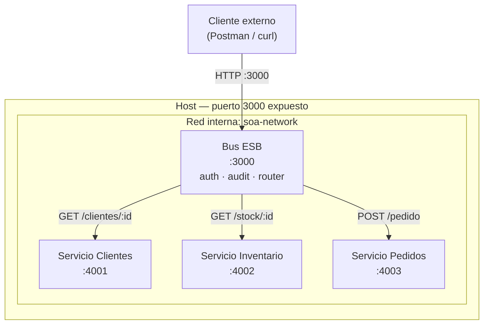

# Mini SOA con Docker

Sistema  que implementa el estilo arquitectónico **SOA (Service-Oriented Architecture)** usando Node.js y Docker. Todos los mensajes fluyen obligatoriamente a través de un Bus de Servicios centralizado; ningún servicio se comunica directamente con otro.

---

## Arquitectura



El **Bus** es el único punto de entrada desde el exterior (puerto 3000). Los servicios internos solo son accesibles dentro de `soa-network` — sus puertos no están expuestos al host.

---

## Cómo usar

### 1. Levantar el sistema

Desde el directorio raíz del proyecto:

```bash
docker-compose up --build
```

Este comando construye las imágenes de los cuatro contenedores y los levanta. Espera hasta ver en consola que los cuatro servicios indican que están escuchando.

### 2. Probar el sistema

#### (a) Sin token de autorización → HTTP 401

```powershell
try {
    Invoke-WebRequest -Method POST http://localhost:3000/pedido `
      -ContentType "application/json" `
      -Body '{"cliente_id": 1, "producto_id": 100}'
} catch {
    $_.Exception.Response.StatusCode.value__
    $_.ErrorDetails.Message
}
```

Respuesta esperada: `401` y cuerpo `{"error":"Token requerido"}`

#### (b) Con token válido pero cliente inexistente → HTTP 404

```powershell
try {
    Invoke-WebRequest -Method POST http://localhost:3000/pedido `
      -Headers @{ Authorization = "Bearer token-secreto-123" } `
      -ContentType "application/json" `
      -Body '{"cliente_id": 99, "producto_id": 100}'
} catch {
    $_.Exception.Response.StatusCode.value__
    $_.ErrorDetails.Message
}
```

Respuesta esperada: `404` y cuerpo `{"error":"Cliente no encontrado"}`

#### (c) Flujo completo con datos válidos → HTTP 201

```powershell
$r = Invoke-WebRequest -Method POST http://localhost:3000/pedido `
  -Headers @{ Authorization = "Bearer token-secreto-123" } `
  -ContentType "application/json" `
  -Body '{"cliente_id": 1, "producto_id": 100}'
$r.StatusCode
$r.Content
```

Respuesta esperada: `201` con cuerpo similar a:
```json
{
  "pedido_id": "f7e8d9c0-b1a2-3456-7890-abcdef123456",
  "cliente_id": 1,
  "producto_id": 100,
  "timestamp": "2026-06-22T10:30:00.123Z"
}
```

---

## Conceptos SOA implementados

### Bus centralizado

El Bus es el único punto de entrada y salida del sistema; ningún servicio puede ser invocado directamente desde el exterior ni por otro servicio. Toda la lógica transversal (autenticación, auditoría, orquestación) se aplica en un solo lugar, sin duplicar código en los servicios. Implementado en `bus/src/index.js` y configurado en `docker-compose.yml`, donde solo el servicio `bus` tiene la sección `ports` expuesta al host.

### Contrato de servicio

Cada servicio expone una interfaz pública definida (rutas HTTP, formatos de entrada/salida y códigos de respuesta) que el Bus conoce y respeta. El contrato es el acuerdo formal entre el productor del servicio y su consumidor; si se respeta, el Bus puede coordinarse con cualquier servicio sin conocer sus detalles internos. Contratos implementados en `services/clientes/src/index.js` (`GET /clientes/:id`), `services/inventario/src/index.js` (`GET /stock/:id`) y `services/pedidos/src/index.js` (`POST /pedido`).

### Orquestación

La orquestación es la capacidad del Bus de coordinar múltiples servicios en una secuencia definida para completar un proceso de negocio compuesto. El Bus invoca los servicios en orden, verifica el resultado de cada paso y detiene el pipeline ante cualquier error. Implementada en `bus/src/orchestrator/pedido.js`: consulta Clientes → verifica stock en Inventario → registra en Pedidos.

### Lógica transversal

Las capacidades transversales (cross-cutting concerns) aplican a todas las operaciones del sistema con independencia del servicio destino: autenticación, auditoría, logging. Centralizarlas en el Bus evita duplicar código y garantiza que ninguna solicitud pueda eludirlas. Autenticación en `bus/src/middleware/auth.js`; auditoría en `bus/src/middleware/audit.js`.

---

## Estructura del proyecto

```
mini-soa-docker/
├── docker-compose.yml          ← Orquestación de los 4 contenedores
├── README.md
├── bus/
│   ├── Dockerfile
│   ├── package.json
│   └── src/
│       ├── index.js            ← Punto de entrada del Bus (Express)
│       ├── middleware/
│       │   ├── auth.js         ← Validación del token (lógica transversal)
│       │   └── audit.js        ← Log de auditoría (lógica transversal)
│       ├── routes/
│       │   └── router.js       ← Definición de rutas del Bus
│       └── orchestrator/
│           └── pedido.js       ← Orquestación del flujo POST /pedido
└── services/
    ├── clientes/
    │   ├── Dockerfile
    │   ├── package.json
    │   └── src/
    │       └── index.js        ← Contrato: GET /clientes/:id
    ├── inventario/
    │   ├── Dockerfile
    │   ├── package.json
    │   └── src/
    │       └── index.js        ← Contrato: GET /stock/:id
    └── pedidos/
        ├── Dockerfile
        ├── package.json
        └── src/
            └── index.js        ← Contrato: POST /pedido
```

---

## Token de autenticación

Para todas las solicitudes válidas usa el encabezado:

```
Authorization: Bearer token-secreto-123
```

---

## Datos precargados

| Servicio   | Datos disponibles                                         |
|------------|-----------------------------------------------------------|
| Clientes   | id: 1 (Ana García), 2 (Luis Pérez), 3 (María López)      |
| Inventario | producto_id: 100 (stock=10), 101 (stock=5), 102 (stock=0) |
| Pedidos    | Vacío al inicio; crece con cada `POST /pedido` exitoso    |

---

## Ver logs de auditoría

```bash
docker-compose logs bus
```

Cada solicitud válida genera dos entradas JSON en el log del Bus:

```json
{ "event": "REQUEST_START", "request_id": "...", "timestamp": "...", "method": "POST", "path": "/pedido", "user": "token-secreto-123" }
{ "event": "REQUEST_END",   "request_id": "...", "status": 201 }
```

El mismo `request_id` aparece en ambas entradas, lo que permite correlacionar inicio y fin de cada solicitud.
